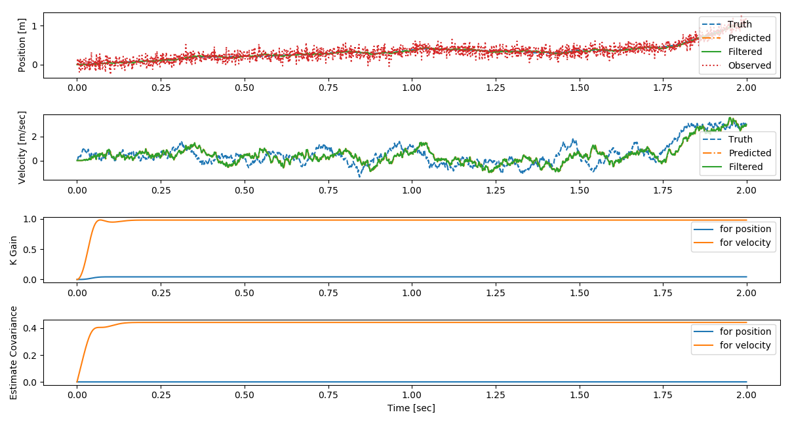
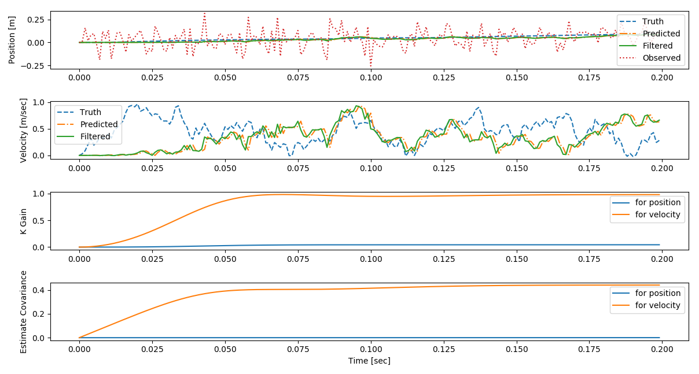
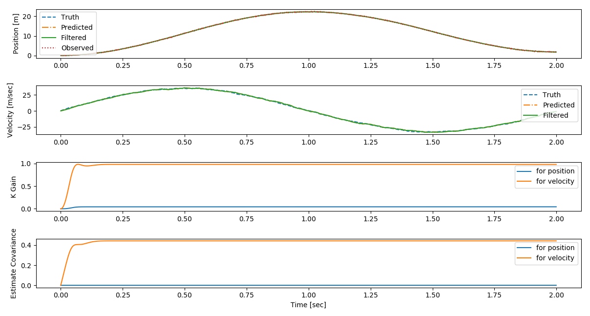

# kf_python_exaple
Python example for Kalman Filter

This is sample python code about [WikiPage](https://en.wikipedia.org/wiki/Kalman_filter#Example_application.2C_technical) page for Kalman Filter setting example.

It's depended on numpy and matplotlib.

## File lists
- ``kf_func.py``
    - Kalman_filter function
- ``wiki_example.py``
    - Example code based on [WikiPage](https://en.wikipedia.org/wiki/Kalman_filter#Example_application.2C_technical)
- ``arx_model.py``
    - Example of parameter estimation of ARX model

## kf_func.py

## Interface of function
```
def kf(Phi, G, H, P, Q, R, z, x, u=0):
    """ Kalman Filtering function
        x(k) = Phi@x(k-1) + u(k-1) + w(k-1)
        z(k) = R@x(k) + v(k)
        w(k) := N(0, Q)
        v(k) := N(0, R)
    Args:
        Phi: dynamics
        G: System noise model
        H: Observation model
        P: Current error covariance matrix
        Q: System noise covariance matrix
        R: Observation noise covariance matrix
        z: Observation vector
        x: State vector
        u: Control input
    Returns: xp, xf, newP, K
        xp: Predicted state
        xf: Filtered state
        newP: Updated P
        K: Kalman gain
    """
```

## wiki_example.py

### Parameters
- sampling time (delta): 0.001 [sec]
- Target end time (endtime): 2.0 [sec]
- num of state (x_num): 2
- num of observation (z_num): 1
- standard deviation of Acceleration (system_sds): 100 [m/sec^2]
- standard deviation of Observation (measure_sds): 0.1 [m]

### Run
```
$ python kf_wiki_sample.py
```

### Result
- whole
    
- Focused (0.0-0.2)
    
- Focused (0.2-0.4)
    

### Another simulatoin (case with control input)
#### Result
- whole
    
- Focused (0.0-0.2)
    
- Focused (0.2-0.4)
    

## arx_model.py

